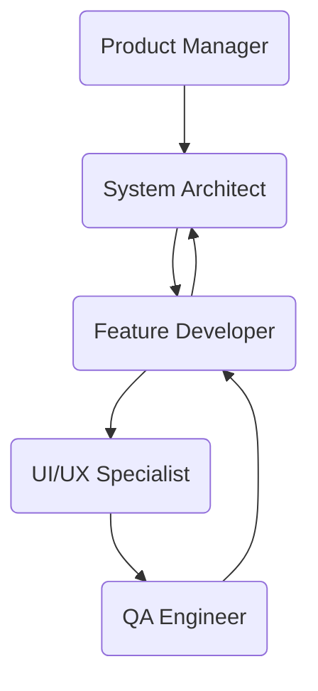

# 🤖 Agentic AI Workflow (Index)

This document defines the Agentic AI structure for the Flutter Premium Base Template. Each specialized agent has its own detailed workflow stored in `.agent/workflows/`.

---

## 🏗️ Agentic Personas

Trigger an agent by using its slash command followed by your request.

| Command  | Persona               | Detailed Design & Rules                                          |
| -------- | --------------------- | ---------------------------------------------------------------- |
| `/agent` | **Smart Dispatcher**  | [.agent/workflows/dispatcher.md](.agent/workflows/dispatcher.md) |
| `/pm`    | **Product Manager**   | [.agent/workflows/pm.md](.agent/workflows/pm.md)                 |
| `/arch`  | **App Architect**     | [.agent/workflows/arch.md](.agent/workflows/arch.md)             |
| `/ui`    | **UI/UX Specialist**  | [.agent/workflows/ui.md](.agent/workflows/ui.md)                 |
| `/dev`   | **Feature Developer** | [.agent/workflows/dev.md](.agent/workflows/dev.md)               |
| `/qa`    | **QA Engineer**       | [.agent/workflows/qa.md](.agent/workflows/qa.md)                 |

---

## 🤝 Collaboration & Artifact Protocol

To ensure seamless work between agents, we follow an **Artifact-Driven** workflow:

1.  **Artifact Mode**: Every major lifecycle phase MUST produce a persistent system artifact (using `is_artifact: true`):
    - `/pm` → `docs/requirements.md` (Feature Specs)
    - `/arch` → `docs/implementation_plan.md` (Design Design)
    - `/dev` & `/ui` → [Source Code] & up-to-date `task.md`
    - Finally → `docs/walkthrough.md` (Delivery Summary)
2.  **Context Inheritance**: Agents MUST read previous artifacts before starting a task.
3.  **Cyclic Interaction**:
    - **PM & Architect**: Translate requirements into structural design.
    - **Architect & Developer**: Sync logic implementation with architectural standards.
    - **Developer & UI**: Polish the presentation layer based on the implementation plan.
4.  **Command Protocol**: For any command involving `flutter` or `dart` (e.g., code generation), agents MUST NOT run them directly. Instead, provide the ready-to-run command in the response for the user to execute manually.

---

## 🔄 Recommended Workflow Lifecycle

---

> [!TIP]
> Use `/agent` if you are unsure about the current state; it will analyze existing artifacts and tell you who's next.

---

_Executed by: Smart Dispatcher_
